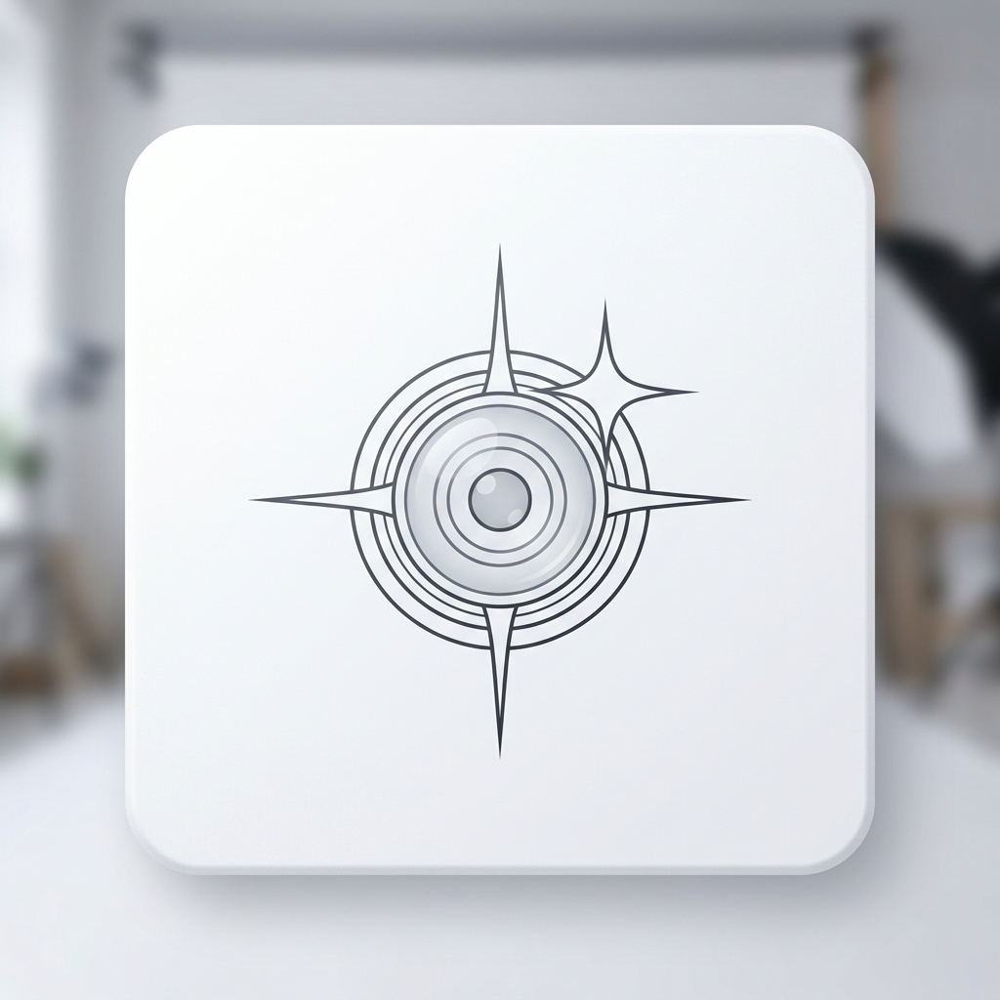

<p align="center">
  
</p>

<h1 align="center">Chroma Studio</h1>

<p align="center">
  <strong>The pro-grade portrait enhancement studio.</strong><br/>
  Rescue out-of-focus portraits. Remove backgrounds. Remove glasses glare. Precision retouching.<br/>
  All running locally on your machine.
</p>

<p align="center">
  
  
  
  
</p>

<p align="center">
  <a href="#features">Features</a> •
  <a href="#how-it-works">How it works</a> •
  <a href="#download">Download</a> •
  <a href="#tech-stack">Tech Stack</a>
</p>

<br/>

<p align="center">
  
</p>

<p align="center">
  <em>High-fidelity neural restoration in a beautiful minimalist interface.</em>
</p>

<br/>

---

## What is Chroma Studio?

Chroma Studio is a **local-first portrait enhancement laboratory**—a specialized tool designed to rescue and refine portraits for professional use. 

The core mission is to solve the two biggest hurdles in professional headshots:
1. **Focus Rescue**: Automatically salvage slightly out-of-focus photography using neural sharpening.
2. **Web-Readiness**: Instantly remove complex backgrounds for clean, professional headshot extraction in seconds.

**Everything listed below is currently in BETA.** This application was videcoded using the Antigravity AI assistant.

---

## Features (BETA)

### 🚀 Performance & Core Tools

| Feature | Status | Description |
| :--- | :--- | :--- |
| **Neural Sharpening** | Stable | GFPGAN v1.3 engine for skin and feature restoration. |
| **Background Removal** | Stable | `rembg` integration for one-click studio-white backgrounds. |
| **HD Scaling** | **BETA** | Real-ESRGAN x2 Plus for super-resolution and print-readiness. |
| **Optical Glare Removal** | **BETA** | Surgical removal of green/cyan or white eye-glass reflections. |
| **Custom Inpaint Studio** | **BETA** | Interactive manual masking with Undo/Redo for directive cleanup. |
| **Film Grain Injection** | Stable | Custom algorithm to maintain photographic soul and texture. |

### 🎨 Minimalist Workflow

A premium white UI designed for zero distraction. High-contrast typography and smooth transitions ensure the focus remains on your photography.

- **Batch Processing**: Upload multiple portraits and process the entire queue with one click.
- **Side-by-Side Comparison**: Interactive slider to verify results against the original raw file.
- **Advanced High-Fidelity Tuning**: Expandable controls for granular scaling and grain strength.

---

## How it works

Chroma Studio combines traditional fluid-dynamics mathematics with state-of-the-art neural networks:

1. **Preprocessing**: The raw image is decoded and normalized for the M1 Neural Engine.
2. **Mathematical Erasure**: If a mask or glare is detected, Navier-Stokes algorithms wipe the artifacts while preserving the color gradients.
3. **Neural Hallucination**: The GFPGAN core looks at the "erased" gaps and hallucinates hyper-realistic skin and eye detail.
4. **Post-Processing**: Scaling and Grain are applied at the final layer to output a clean, website-ready asset.

---

## Tech Stack

| Layer | Technology |
| :--- | :--- |
| **Desktop Frontend** | React, Vite, Lucide-React |
| **Backend API** | FastAPI (Python) |
| **Neural Engine** | GFPGAN v1.3 |
| **Upscaling** | Real-ESRGAN x2 Plus |
| **Hardware Accel** | Metal Performance Shaders (MPS / MLX) |
| **Styling** | Vanilla CSS (Minimalist White Theme) |

---

## Development

Chroma Studio is specifically optimized for hardware with **iMac M1 (16GB RAM)** or newer.

### Quick Start

```bash
# Set up Python environment
pip install -r backend/requirements.txt

# Install Node dependencies
cd frontend && npm install

# Launch everything
./launch.sh
```

### Project Structure
```text
chroma-studio/
├── backend/          # Python FastAPI server & AI logic
├── frontend/         # React/Vite web application
├── launch.sh         # One-click startup script
└── README.md         # This high-fidelity documentation
```

---

## License

MIT License — see [LICENSE](LICENSE) for details.

---

<p align="center">
  <em>Developed with ❤️ as my first Antigravity-videcoded project.</em>
</p>
